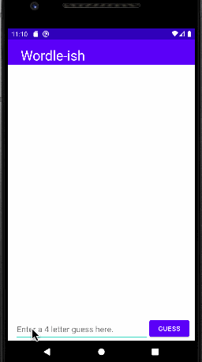

# Android Project 1 - *Wordle App*

Submitted by: **Ruben Velasquez**

This is an android app that recreates a simple version of the popular word game [Wordle](https://www.nytimes.com/games/wordle/index.html). 

## Legend:
'O' - Letter is in correct position

'X' - Letter is not in answer

'+' - Letter is in answer, but wrong position

Time spent: **6** hours spent in total

## Required Features

The following **required** functionality is completed:

- [X] **User has 3 chances to guess a random 4 letter word**
- [X] **After 3 guesses, user should no longer be able to submit another guess**
- [X] **After each guess, user sees the "correctness" of the guess**
- [X] **After all guesses are taken, user can see the target word displayed**

The following **optional** features are implemented:

- [ ] User can toggle betweeen different word lists
- [ ] User can see the 'correctness' of their guess through colors on the word 
- [X] User sees a visual change after guessing the correct word
- [X] User can tap a 'Reset' button to get a new word and clear previous guesses
- [ ] User will get an error message if they input an invalid guess
- [ ] User can see a 'streak' record of how many words they've guessed correctly.

The following **additional** features are implemented:

* [X] Hide keyboard on guess submission

## Video Walkthrough

Here's a walkthrough of implemented features:

<!-- Replace this with whatever GIF tool you used! -->
GIF created with LiceCap ...  
<!-- Recommended tools:
[ScreenToGif](https://www.screentogif.com/) for Windows
[peek](https://github.com/phw/peek) for Linux. -->

## Notes

## License

    Copyright 2022 Ruben Velasquez

    Licensed under the Apache License, Version 2.0 (the "License");
    you may not use this file except in compliance with the License.
    You may obtain a copy of the License at

        http://www.apache.org/licenses/LICENSE-2.0

    Unless required by applicable law or agreed to in writing, software
    distributed under the License is distributed on an "AS IS" BASIS,
    WITHOUT WARRANTIES OR CONDITIONS OF ANY KIND, either express or implied.
    See the License for the specific language governing permissions and
    limitations under the License.
